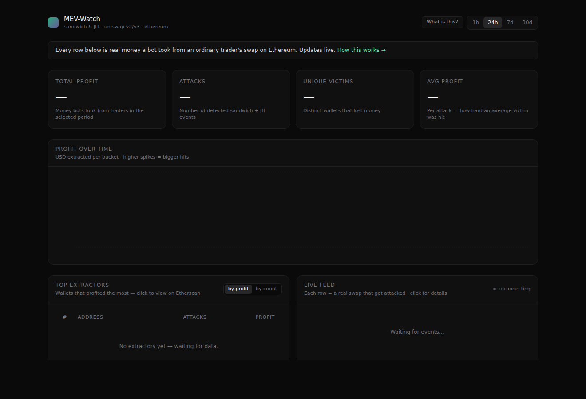

# MEV-Watch

Real-time MEV detection on Ethereum. Detects sandwich attacks and JIT
liquidity on Uniswap V2 / V3, computes honest net profit (gross − gas),
and exposes everything over a public REST + SSE API.



**Status:** MVP complete — ingester, detector, REST + SSE API, and a
Next.js web UI. Ships as a single `docker compose up` with optional
Caddy for HTTPS.

---

## Quick start

```bash
cp .env.example .env
# edit .env: set ETH_WS_URL and ETH_HTTP_URL to your Alchemy endpoints

docker compose up -d postgres     # start DB first (runs db/init.sql)
docker compose up -d ingester     # live ingestion
docker compose up -d detector     # runs every DETECTOR_INTERVAL_SEC
docker compose up -d api          # FastAPI on :8001 (host) → :8000 (container)
docker compose up -d web          # Next.js UI on :3000

# optional reverse proxy + HTTPS (set CADDY_DOMAIN in .env first)
docker compose up -d caddy
```

Get an Alchemy key at [dashboard.alchemy.com](https://dashboard.alchemy.com/) →
create an Ethereum Mainnet app. The free tier (300M CU/mo) is enough for live
ingestion indefinitely.

Open [http://localhost:8000/docs](http://localhost:8000/docs) for OpenAPI UI.

---

## Architecture

```
 ┌────────────┐   ws    ┌───────────┐      ┌──────────────┐
 │  Alchemy   │────────▶│ ingester  │─────▶│   Postgres   │
 └────────────┘         └───────────┘      │ + TimescaleDB│
                                           └──────┬───────┘
                                                  │
                      ┌───────────────────────────┼────────────────────┐
                      │                           │                    │
              ┌───────▼────────┐          ┌───────▼──────┐    ┌────────▼───────┐
              │   detector     │          │     api      │    │  backfiller    │
              │ (sandwich+JIT) │          │  (FastAPI)   │    │ (in ingester)  │
              └────────────────┘          └──────┬───────┘    └────────────────┘
                                                 │
                                          ┌──────▼──────┐
                                          │    Caddy    │
                                          │  (HTTPS)    │
                                          └─────────────┘
```

Four Python services, one Postgres, one proxy. Services decouple through
the database — no message queue needed at MVP scale.

---

## API

All endpoints live under `/api/v1`.

| Endpoint | Description |
|---|---|
| `GET /events?type=sandwich&min_profit_usd=10&since=…&limit=50&before=<id>` | Paginated list of MEV events |
| `GET /events/{id}` | Full event details |
| `GET /events/stream` | Server-Sent Events — pushes every new event |
| `GET /leaderboard?period=24h&by=profit&type=sandwich` | Top 50 extractors |
| `GET /stats?period=24h` | Aggregates (profit, count, victims, top pools, hourly series) |
| `GET /address/{0x…}` | Profile for an extractor address |
| `GET /health` | Liveness |

`period` ∈ {`1h`, `24h`, `7d`, `30d`}. `by` ∈ {`profit`, `count`}.

---

## Detection algorithms

### Sandwich

Same pool, same block:
1. `front`: swap `A → B` by extractor `E`
2. `victim`: swap `A → B` by actor ≠ `E`
3. `back`: swap `B → A` by `E`

with `tx_index(front) < tx_index(victim) < tx_index(back)` and
`back.amount_out > front.amount_in`.

Two EOAs count as the same actor if either share a signer or call the
same contract (MEV bot contract). A sanity cap of `back.out ≤ front.in × 2`
filters multi-hop artefacts.

### JIT liquidity (Uniswap V3)

Same pool, same block:
1. `mint` by owner `O` with ticks `(L, U)` and liquidity `L₀`
2. at least one non-`O` swap
3. `burn` by `O` with the same `(L, U, L₀)`

Profit estimated as `victim.amount_in × pool.fee_tier / 1_000_000` — an
upper-bound capture of swap fees. True capture depends on other LPs in
range; this is documented and surfaced in `metadata.quote_unavailable` when
we can't price the fee token.

---

## Economics

`net_profit = gross_profit − gas_cost`. **Bribes to block builders are
ignored in the MVP** (they require trace access for accurate decoding).
This underestimates profit for attacks routed through Flashbots/MEV-boost;
the raw column `bribe_wei` is kept at 0 and wired for a future v2.

USD conversion uses the Uniswap V3 USDC/WETH 0.05% pool's `slot0()` at the
ingest block. Non-WETH/non-stable profit tokens are priced via the same
pool when possible; otherwise the event stores `net_profit_usd = NULL` and
`metadata.quote_unavailable = true`.

Minimum event profit for persistence: `MIN_NET_PROFIT_USD` env (default
`$1`). Events without a USD quote are always persisted.

---

## Configuration

All settings live in `.env` (see `.env.example`). Key knobs:

| Var | Default | Purpose |
|---|---|---|
| `ETH_WS_URL` | — | WebSocket endpoint (newHeads subscription) |
| `ETH_HTTP_URL` | — | HTTP endpoint (block fetches, eth_call) |
| `INGESTER_WORKERS` | `4` | Parallel block workers |
| `BLOCK_CONFIRMATIONS` | `2` | Wait this many blocks before processing (reorg safety) |
| `BACKFILL_BLOCKS` | `0` | Backwards catch-up depth from first-seen block. `50000 ≈ 7 days` |
| `DETECTOR_INTERVAL_SEC` | `10` | Detector poll cadence |
| `MIN_NET_PROFIT_USD` | `1.0` | Below this USD, events are dropped |
| `CADDY_DOMAIN` | `:80` | Set to your domain for automatic HTTPS via Let's Encrypt |

---

## Validation

1. `docker compose up -d postgres` — tables exist, TimescaleDB extension active.
   ```bash
   docker compose exec postgres psql -U mev -d mev_watch -c "\dt"
   docker compose exec postgres psql -U mev -d mev_watch -c "SELECT extname FROM pg_extension;"
   ```

2. `docker compose up ingester` — logs show `block_processed` with non-zero
   swap counts after ~30 s.

3. After 10 minutes:
   ```bash
   docker compose exec postgres psql -U mev -d mev_watch -c \
     "SELECT COUNT(*) FROM swaps; SELECT COUNT(*) FROM v3_liquidity_events;"
   ```
   Expect hundreds of swaps, some liquidity events.

4. `docker compose up detector` — within 1–2 min:
   ```bash
   docker compose exec postgres psql -U mev -d mev_watch -c \
     "SELECT block_number, event_type, net_profit_usd FROM mev_events
      ORDER BY block_number DESC LIMIT 10;"
   ```

5. Spot-check: copy `frontrun_tx`, `victim_tx`, `backrun_tx` and open each
   on Etherscan — tx indexes should be adjacent-ish, victim's swap in the
   same direction as front, back reverses.

6. `curl -s localhost:8000/api/v1/events?limit=5 | jq .`

7. SSE:
   ```bash
   curl -N localhost:8000/api/v1/events/stream
   # emits {"event":"ping","data":"{}"} every 15s when idle,
   # {"event":"mev","data":"{...}"} on new detection
   ```

---

## Project layout

```
.
├── docker-compose.yml
├── Caddyfile
├── .env.example
├── deploy/
│   └── DEPLOY.md             # production-readiness checklist
├── db/
│   └── init.sql              # schema + pg_notify trigger
├── frontend/                 # Next.js 15 + Tailwind + Recharts UI
│   ├── app/                  # routes incl. proxied /api/v1/*
│   ├── components/           # LiveFeed, Leaderboard, KPIs, charts
│   └── lib/                  # API client, types, formatters
└── backend/
    ├── pyproject.toml
    ├── Dockerfile
    └── mev_watch/
        ├── config.py         # ENV via pydantic-settings
        ├── db.py             # asyncpg pool
        ├── rpc.py            # web3.py async clients
        ├── constants.py      # topic hashes, token/pool addresses
        ├── abi.py            # minimal ABIs
        ├── utils.py          # hex↔bytes, wei↔USD
        ├── logging.py        # structlog bootstrap
        ├── ingester/
        │   ├── listener.py   # WS newHeads → queue
        │   ├── worker.py     # block + receipts → DB
        │   ├── decoding.py   # V2/V3 Swap/Mint/Burn decoders
        │   ├── reference.py  # lazy pool/token bootstrap
        │   ├── prices.py     # slot0 → ETH/USD
        │   ├── backfill.py   # historical catch-up
        │   └── __main__.py
        ├── detector/
        │   ├── sandwich.py   # PRD §6.1
        │   ├── jit.py        # PRD §6.2
        │   ├── economics.py  # gross/gas/net USD
        │   ├── runner.py     # block loader + persistence
        │   ├── types.py      # dataclasses
        │   └── __main__.py
        └── api/
            ├── app.py        # FastAPI + CORS + lifespan
            ├── routes.py     # 5 endpoints + SSE
            ├── queries.py    # SQL centralized
            ├── schemas.py    # pydantic response models
            └── __main__.py
```

---

## Known limitations (v1)

- **No bribe accounting.** Flashbots attacks with large `coinbase.transfer`
  bribes show inflated net profit (we don't subtract the bribe).
- **Only Uniswap V2 + V3.** Curve, Balancer, Sushi and L2s are v2 scope.
- **JIT profit is an upper bound** (assumes full liquidity capture).
- **No CEX-DEX arbitrage** (requires off-chain data).
- **Reorgs deeper than `BLOCK_CONFIRMATIONS`** (2 by default) could produce
  stale data; the ingester re-ingests on re-seeing a block but the detector
  won't automatically redo it unless `detected_at` is reset.

---

## Roadmap (v2)

1. Bribe decoding via `debug_traceTransaction`
2. Liquidations (Aave, Compound, Maker)
3. Cross-DEX arbitrage detection
4. L2 support (Base, Arbitrum, Optimism)
5. Searcher clustering (group EOAs/contracts into "entities")
6. Paid API tier with keys + quotas

---

